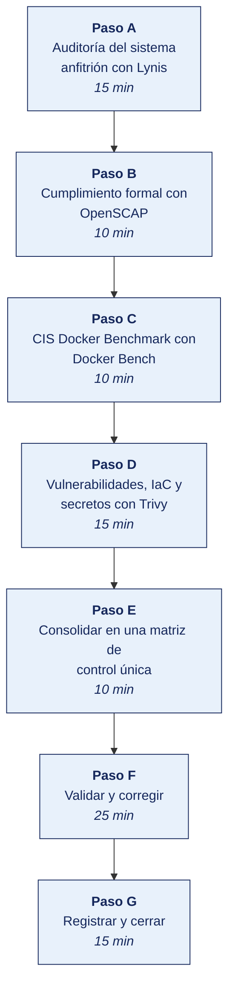

[Semana 04](README.md) · [Teoría](1-TEORIA.md) · [Dinámica de aula](2-DINAMICA.md) · **Taller de laboratorio**

# Taller de laboratorio 04 · Auditoría de configuración segura con Lynis, OpenSCAP, Docker Bench y Trivy

**SI-084 · Auditoría de Sistemas** · Semana 04 · Sesión 2 en laboratorio · 100 min · calificación **procedimental**

> ¿Un término no le resulta claro? Está definido en el [glosario técnico del curso](../GLOSARIO.md).

---

## Secuencia del taller



## Qué entregas

| | |
|---|---|
| **Archivo** | `SI084-S04-TALLER-Grupo<N>.pdf` |
| **Plantilla obligatoria** | [SI084-PLANTILLA-TALLER.docx](../PLANTILLAS/SI084-PLANTILLA-TALLER.docx) |
| **Formato** | PDF exportado desde la plantilla en Word, con la carátula de la UPT, el índice actualizado y las capturas numeradas |
| **Qué va dentro** | Las secciones de la plantilla. La **5. Resultados y evidencias** se califica contra la tabla de resultados esperados de esta guía, y **cada resultado necesita la evidencia que lo demuestre**. No se copian de aquí los objetivos, la duración ni los resultados de aprendizaje |
| **Dónde se sube** | Aula virtual, tarea «Taller · Semana 04» |
| **Cuándo vence** | 48 horas después de la sesión de laboratorio |

> No se califica un informe entregado en `.docx`, sin carátula, sin los códigos de los integrantes o con resultados declarados sin evidencia.

---

## El reto

| | |
|---|---|
| **Situación** | Cuatro herramientas devuelven cuatro listas que no hablan entre sí. Nadie puede decir cuántos controles fallan, porque cada una los cuenta a su manera. |
| **Misión** | Consolidar las cuatro salidas en una matriz única mapeada a ISO/IEC 27001 y COBIT 2019, y clasificar a mano lo que la automatización no supo clasificar. |
| **Criterio de éxito** | Menos del 20 % de los hallazgos queda «Sin clasificar», y al menos uno se analiza como deficiencia de diseño frente a deficiencia de eficacia operativa. |

## 1. Información sobre el evento práctico

### 1.1. Título del evento práctico

Evaluación automatizada de controles generales de TI mediante herramientas libres de auditoría de configuración (*compliance scanning*), contrastando la evidencia técnica contra los CIS Benchmarks y el Anexo A de la ISO/IEC 27001:2022.

### 1.2. Objetivos

- Ejecutar **Lynis** para auditar el endurecimiento del sistema operativo anfitrión.
- Ejecutar **OpenSCAP** con la guía SCAP Security Guide para evaluar cumplimiento contra un perfil normativo formal.
- Ejecutar **Docker Bench for Security** para auditar el plano de contenedores contra el CIS Docker Benchmark.
- Ejecutar **Trivy** para auditar vulnerabilidades de imágenes, malas configuraciones IaC y **secretos embebidos**.
- **Consolidar los cuatro reportes en una matriz de control única** mapeada a ISO/IEC 27001:2022 y COBIT 2019.
- Distinguir, sobre evidencia real, una **deficiencia de diseño** de una **deficiencia de eficacia operativa**.

### 1.3. Tiempo de duración

**100 minutos.**

### 1.4. Resultados de Aprendizaje (RA)

- **RA1** Analiza e interpreta los conceptos y terminología de Auditoría de Sistemas.
- **RA2** Evalúa la seguridad de la información en Auditoría de Sistemas.

### 1.5. Recursos

| Recurso | Detalle |
|---|---|
| Entorno `si084-lab` | Semanas 01–03 operativas |
| **Lynis** | https://cisofy.com/lynis/ — `docker run --rm -it --pid host --net host -v /:/rootfs:ro ...` |
| **OpenSCAP + SCAP Security Guide** | https://www.open-scap.org/ y https://github.com/ComplianceAsCode/content |
| **Docker Bench for Security** | https://github.com/docker/docker-bench-security |
| **Trivy** | https://trivy.dev/ — imagen `aquasec/trivy` |
| **CIS Benchmarks** | https://www.cisecurity.org/cis-benchmarks (descarga gratuita previo registro) |
| Python 3.11+ con `pandas` | Consolidación de reportes |

### 1.6. Seguridad

1. Lynis y Docker Bench requieren acceso de lectura al sistema anfitrión; se ejecutan **solo en el equipo del propio estudiante**, nunca en un equipo compartido del laboratorio sin autorización del administrador.
2. Los reportes contienen el inventario de software y versiones del equipo. Se clasifican como **Confidencial** y **no se publican en repositorios públicos**.
3. Trivy en modo `secret` puede detectar credenciales reales presentes en el equipo. Si aparece un secreto real, **se reporta al docente y se elimina del reporte antes de entregarlo**; no se transcribe en el informe.
4. Ninguna herramienta se ejecuta contra equipos de la red del campus.

---

## 2. Procedimiento o Metodología

> **Documento del caso para esta semana.** La organización entrega **Narrativa del proceso de compras y pagos**, en `CASOS/EMPRESA-<NN>-<slug>/documentos/narrativa-proceso-compras.md`. Es consistente con los datos de `datos/`. Las personas, usuarios y proveedores que menciona existen en los archivos. **No señala sus debilidades**; declara lo que la organización dice hacer.

### Paso A — Auditoría del sistema anfitrión con Lynis

```bash
mkdir -p 20_evidencia/E04_config && cd 20_evidencia/E04_config

docker run --rm -it \
  --pid host --net host \
  -v /:/rootfs:ro \
  -v "$PWD":/salida \
  docker.io/cisofy/lynis:latest audit system --forensics \
  --report-file /salida/lynis-report.dat | tee lynis-consola.txt

# Índice de endurecimiento (métrica que se sigue entre auditorías)
grep -E '^hardening_index=' lynis-report.dat
# Sugerencias y advertencias
grep -E '^(warning|suggestion)\[\]=' lynis-report.dat | head -40
```

**Lectura de auditor.** El `hardening_index` es un número entre 0 y 100. Su valor absoluto importa menos que **su trayectoria entre auditorías** y **qué controles específicos lo deprimen**. Se identifican las tres advertencias de mayor severidad y se anota, para cada una, el control ISO correspondiente.

### Paso B — Cumplimiento formal con OpenSCAP

Lynis da recomendaciones; OpenSCAP evalúa contra un **perfil normativo formal y versionado**, que es lo que un auditor puede citar como criterio.

```bash
docker run --rm -it -v "$PWD":/salida ubuntu:22.04 bash -c '
  apt-get update -qq && apt-get install -y -qq libopenscap8 ssg-debderived >/dev/null
  # Listar perfiles disponibles en la guía
  oscap info /usr/share/xml/scap/ssg/content/ssg-ubuntu2204-ds.xml | head -40
  # Evaluar contra el perfil CIS Level 1 Server
  oscap xccdf eval \
    --profile xccdf_org.ssgproject.content_profile_cis_level1_server \
    --results /salida/oscap-resultados.xml \
    --report  /salida/oscap-reporte.html \
    /usr/share/xml/scap/ssg/content/ssg-ubuntu2204-ds.xml || true
'
```

Se abre `oscap-reporte.html` en el navegador. Para el papel de trabajo se extraen:

- Total de reglas evaluadas, aprobadas y fallidas.
- Las **cinco reglas fallidas de severidad alta**, con su identificador XCCDF completo (que es el criterio citable).
- Para cada una, la referencia cruzada al control ISO/IEC 27001 o NIST que la propia guía declara.

### Paso C — CIS Docker Benchmark con Docker Bench

```bash
cd ../../ && git clone --depth 1 https://github.com/docker/docker-bench-security.git
cd docker-bench-security
sudo sh docker-bench-security.sh -l ../20_evidencia/E04_config/docker-bench.log
cd ../20_evidencia/E04_config

grep -E '^\[WARN\]' docker-bench.log | tee docker-bench-warn.txt | wc -l
grep -E '^\[INFO\]' docker-bench.log | head -20
```

Las secciones que más hallazgos producen y su lectura de auditoría:

| Sección CIS Docker | Qué evalúa | Control ISO/IEC 27001:2022 |
|---|---|---|
| 1 — Configuración del anfitrión | Partición separada, versión del *daemon*, auditoría de archivos de Docker | A.8.9, A.8.15 |
| 2 — *Daemon* de Docker | TLS, registros de confianza, `userns-remap`, tráfico entre contenedores | A.8.20, A.8.21 |
| 4 — Imágenes | Usuario no root, imágenes firmadas, `HEALTHCHECK`, ausencia de secretos | A.8.28, A.8.31 |
| 5 — *Runtime* | Privilegios, capacidades, montaje del socket de Docker, límites de recursos | A.8.9, A.8.6 |

> **Hallazgo casi garantizado.** La regla 5.31 («el socket de Docker no debe montarse dentro de contenedores») y la 4.1 («los contenedores deben ejecutarse con un usuario distinto de root») fallan en la mayoría de laboratorios. Ambas se traducen en una **escalada de privilegios del contenedor al anfitrión**, y esa es la redacción de negocio que debe llevar el hallazgo.

### Paso D — Vulnerabilidades, IaC y secretos con Trivy

```bash
TRIVY="docker run --rm -v /var/run/docker.sock:/var/run/docker.sock -v $PWD:/out aquasec/trivy"

# 1. Vulnerabilidades de las imágenes del entorno auditado
for IMG in bkimminich/juice-shop:latest postgres:16 wordpress:latest mariadb:11; do
  N=$(echo $IMG | tr '/:' '__')
  $TRIVY image --severity HIGH,CRITICAL --format json -o /out/trivy_${N}.json $IMG
  $TRIVY image --severity HIGH,CRITICAL $IMG | tee -a /out/trivy_resumen.txt
done

# 2. Malas configuraciones en la infraestructura como código
$TRIVY config --severity HIGH,CRITICAL /out/../../entorno | tee /out/trivy_iac.txt

# 3. Secretos embebidos en el repositorio de trabajo
$TRIVY fs --scanners secret /out/../.. | tee /out/trivy_secretos.txt

# 4. Inventario de componentes (SBOM) — exigido crecientemente en contratos
$TRIVY image --format cyclonedx -o /out/sbom_juiceshop.json bkimminich/juice-shop:latest
```

**Por qué importa el SBOM.** El *Software Bill of Materials* es el inventario de componentes de un producto de software. Sin él, ante la publicación de una vulnerabilidad crítica en una biblioteca, la organización no puede responder en horas la pregunta «¿estamos afectados?». Ese es un **control detectivo de gestión de vulnerabilidades** (ISO/IEC 27001:2022, A.8.8) y su ausencia es un hallazgo de diseño.

### Paso E — Consolidar en una matriz de control única

Cuatro reportes en cuatro formatos distintos no son un papel de trabajo. Se consolidan:

```python
# 30_papeles_trabajo/PT04_matriz_control.py
import pandas as pd, json, re, glob

filas = []

# --- Lynis ---
for l in open("../20_evidencia/E04_config/lynis-report.dat"):
    if l.startswith("warning[]=") or l.startswith("suggestion[]="):
        tipo = "warning" if l.startswith("warning") else "suggestion"
        filas.append(dict(herramienta="Lynis", severidad="Alta" if tipo=="warning" else "Media",
                          hallazgo=l.split("=",1)[1].strip()[:160]))

# --- Docker Bench ---
for l in open("../20_evidencia/E04_config/docker-bench.log"):
    if l.startswith("[WARN]"):
        filas.append(dict(herramienta="Docker Bench", severidad="Alta",
                          hallazgo=l.replace("[WARN]","").strip()[:160]))

# --- Trivy imágenes ---
for f in glob.glob("../20_evidencia/E04_config/trivy_*.json"):
    d = json.load(open(f))
    for res in d.get("Results", []):
        for v in res.get("Vulnerabilities", []) or []:
            filas.append(dict(herramienta="Trivy", severidad=v["Severity"].capitalize(),
                              hallazgo=f'{v["VulnerabilityID"]} en {v["PkgName"]} {v.get("InstalledVersion","")}'))

m = pd.DataFrame(filas)

# --- MAPEO AL CRITERIO · sin esto la salida es ruido, no auditoría ---
MAPEO = [
    (r"root|privileg|capab",              "A.8.2 Privileged access rights",        "DSS05.04"),
    (r"password|credential|secret|auth",  "A.5.17 Authentication information",     "DSS05.04"),
    (r"CVE-|vulnerab|outdated|version",   "A.8.8 Management of technical vulnerabilities", "DSS05.07"),
    (r"log|audit|journal",                "A.8.15 Logging",                        "DSS01.03"),
    (r"tls|ssl|cipher|encrypt|certificate","A.8.24 Use of cryptography",           "DSS05.03"),
    (r"firewall|port|network|expose",     "A.8.20 Networks security",              "DSS05.02"),
    (r"config|default|hardening",         "A.8.9 Configuration management",        "BAI10.02"),
    (r"backup|restore",                   "A.8.13 Information backup",             "DSS04.07"),
]
def clasifica(t):
    for pat, iso, cobit in MAPEO:
        if re.search(pat, t, re.I):
            return pd.Series([iso, cobit])
    return pd.Series(["Sin clasificar", "Sin clasificar"])

m[["control_iso27001","objetivo_cobit"]] = m["hallazgo"].apply(clasifica)
m.to_csv("../40_hallazgos/PT04_matriz_control.csv", index=False)

print("Hallazgos por herramienta:\n", m.groupby(["herramienta","severidad"]).size().to_string())
print("\nHallazgos por control ISO:\n", m["control_iso27001"].value_counts().to_string())
print(f"\nSin clasificar: {(m.control_iso27001=='Sin clasificar').sum()} "
      f"({(m.control_iso27001=='Sin clasificar').mean():.0%}) — revisar manualmente")
```

**Cierre de la sesión (10 min).** Cada equipo elige el control con más hallazgos concentrados y responde en el papel de trabajo. *¿Esto es una deficiencia de **diseño** (el control no existe) o de **eficacia operativa** (el control existe pero no se ejecutó)?* La respuesta determina la recomendación. En el primer caso se diseña el control; en el segundo se corrige el proceso que lo dejó de ejecutar.

```bash
sha256sum 20_evidencia/E04_config/* 40_hallazgos/PT04_matriz_control.csv >> 20_evidencia/SHA256SUMS_E04.txt
git add . && git commit -m "E04: auditoria de configuracion segura y matriz de control consolidada"
```

---

### Paso F — Validar y corregir (25 min)

El resultado no vale por estar hecho, sino por resistir una comprobación. Se ejecutan estas tres y **se corrige lo que falle antes de cerrar la sesión**.

1. Contar el porcentaje de hallazgos «Sin clasificar» en la matriz y comprobar que está por debajo del 20 %.
2. Verificar que cada regla fallida de severidad alta lleva su identificador XCCDF, no solo su descripción.
3. Comprobar que el control analizado como deficiencia de **diseño** lo es de verdad. El control no existe, frente a existe pero no opera.

> Lo que no se pueda corregir hoy se anota en la sección **Problemas y mejoras** de la evidencia, con lo que faltó y por qué. Un resultado parcial documentado con honestidad vale más que uno declarado sin prueba.

### Paso G — Registrar la evidencia y cerrar (15 min)

Se versiona lo producido, se anota la URL de cada resultado y se responde en dos frases la pregunta de transferencia — **qué riesgo correría una organización real si esto se hiciera mal**.

---

## 3. Resultados

> **Evidencia obligatoria en GitHub.** Todo resultado de este taller se versiona en el repositorio del equipo. El informe **no consigna capturas sueltas**. Consigna la **URL** del artefacto en GitHub. Una captura no permite verificar autoría, fecha ni contenido; un enlace sí.
>
> | Qué se entrega | Dónde vive | Qué se escribe en el informe |
> |---|---|---|
> | Código y archivos de configuración | Rama del taller, fusionada a `develop` vía Pull Request | URL del Pull Request |
> | Documentos y matrices | `docs/`, en formato de texto versionable | URL del archivo en la rama |
> | Capturas y videos que el taller exija | `docs/evidencias/S04/` | URL del archivo |
> | Salida de comandos | `docs/evidencias/S04/salidas/*.txt` | URL del archivo |
>
> **Etiqueta del taller.** Al cerrar el taller se crea la etiqueta `taller-04` sobre el commit entregado:
>
> ```bash
> git tag -a taller-04 -m "Taller 04 · SI084"
> git push origin taller-04
> ```
>
> La URL que se consigna en el informe apunta a esa etiqueta:
> `https://github.com/<organizacion>/<repositorio>/tree/taller-04`
>
> **El informe es lo que se califica; el repositorio es lo que lo prueba.** Cada resultado de la sección 3 del informe lleva la URL con la que se verifica, y **un resultado sin su URL se califica como no logrado**, por bien redactado que esté. Lo que no se puede abrir no se puede dar por hecho.

### 3.1. Los tres resultados que se califican

Son los que la rúbrica evalúa. El resto de la lista tiene que existir, pero no se califica fila por fila.

| Resultado | Qué demuestra | Dónde está |
|---|---|---|
| **La matriz de control única** | Los hallazgos de las cuatro herramientas mapeados a ISO/IEC 27001 y COBIT 2019 | `PT04_matriz_control.csv` |
| **La clasificación completada** | Menos del 20 % sin clasificar, con el resto resuelto a mano | Salida del script |
| **Diseño frente a eficacia operativa** | Un control analizado en ambos planos, con su justificación | Papel de trabajo |

### 3.2. Lista de comprobación del taller

Todo esto debe existir al cerrar la sesión.

| # | Resultado esperado | Verificación |
|---|---|---|
| 1 | `lynis-report.dat` con `hardening_index` extraído y las 3 advertencias de mayor severidad analizadas | Papel de trabajo |
| 2 | `oscap-reporte.html` con el perfil evaluado y las 5 reglas fallidas de severidad alta con su identificador XCCDF | Reporte HTML |
| 3 | `docker-bench.log` con el conteo de `[WARN]` y el análisis de las secciones 4 y 5 | Log y papel de trabajo |
| 4 | **Reportes de Trivy.** Imágenes, IaC, secretos y **un SBOM en CycloneDX** | Archivos generados |
| 5 | `PT04_matriz_control.csv` con todos los hallazgos mapeados a ISO/IEC 27001 y COBIT 2019 | Contenido del CSV |
| 6 | **Menos del 20 % de hallazgos «Sin clasificar»**, con los restantes clasificados manualmente | Salida del script |
| 7 | Un control analizado explícitamente como deficiencia de **diseño** vs. de **eficacia operativa**, con justificación | Papel de trabajo |
| 8 | Hashes en la cadena de custodia y *commit* en Git | `SHA256SUMS_E04.txt` |

## Rúbrica procedimental (20 puntos)

Se aplica sobre el informe entregado y la evidencia enlazada en el repositorio. **Cada criterio se califica de forma independiente.**

| Criterio | 4 — Logrado | 2 — En proceso | 0 — Insuficiente |
|---|---|---|---|
| **Auditoría del sistema anfitrión con Lynis** | Completo y correcto, con la evidencia que lo respalda | Completo con errores menores, o correcto pero sin toda la evidencia | Incompleto, o entregado sin ejecutar |
| **Vulnerabilidades, IaC y secretos con Trivy** | Completo y correcto, con la evidencia que lo respalda | Completo con errores menores, o correcto pero sin toda la evidencia | Incompleto, o entregado sin ejecutar |
| **Evidencia verificable en el repositorio** | Cada resultado tiene su URL sobre la etiqueta `taller-NN`, y el enlace abre lo que dice | La mayoría tiene URL; alguna evidencia es una captura suelta | Se declaran resultados sin enlace, o el enlace no corresponde |
| **Trazabilidad de la evidencia** | Todo hallazgo o dato se rastrea hasta el archivo, registro y fecha que lo sustenta | Rastreable en su mayoría; algún dato sin origen | Se afirman hechos sin poder ubicarlos en la evidencia |
| **La evidencia entregada** | Las secciones de la plantilla completas; los papeles de trabajo quedan archivados y referenciados | Secciones completas con papeles de trabajo incompletos | Faltan secciones o no hay papeles de trabajo |

| Puntaje | Equivalencia |
|---|---|
| 18 – 20 | Destacado |
| 14 – 17 | Logrado |
| 6 – 13 | En proceso |
| 0 – 5 | Insuficiente |

> **Un resultado declarado sin evidencia enlazada no se califica**, aunque el trabajo se haya hecho. La tabla de la sección 3.1 es la lista de cotejo; esta rúbrica es lo que determina la nota.

## 4. Conclusiones

Mínimo tres. Líneas argumentales esperadas:

1. Las herramientas automatizadas producen *hallazgos técnicos*; solo el mapeo a un criterio normativo los convierte en *hallazgos de auditoría* que la organización puede discutir, priorizar y remediar.
2. Cuatro herramientas sobre el mismo sistema producen listas parcialmente solapadas y parcialmente contradictorias; la consolidación con un criterio único es trabajo del auditor y no es automatizable sin decidir el mapeo.
3. Una deficiencia de diseño y una de eficacia operativa exigen recomendaciones opuestas. La primera pide construir el control, la segunda pide corregir el proceso que dejó de ejecutarlo. Confundirlas produce recomendaciones que la organización no puede implementar.

## 5. Referencias Bibliográficas

- ISO/IEC 27001:2022, Anexo A, temas A.7 (Físicos) y A.8 (Tecnológicos). https://www.iso.org/standard/27001
- ISO/IEC 27002:2022. *Information security controls*. https://www.iso.org/standard/75652.html
- ISACA. (2018). *COBIT 2019 Framework: Governance and Management Objectives*, dominios BAI y DSS. https://www.isaca.org/resources/cobit
- COSO (*Committee of Sponsoring Organizations of the Treadway Commission*). (2013). *Internal Control — Integrated Framework*. https://www.coso.org/guidance-on-ic
- U.S. Congress. (2002). *Sarbanes-Oxley Act of 2002*, Public Law 107-204, secciones 302 y 404. https://www.govinfo.gov/app/details/PLAW-107publ204
- Superintendencia de Banca, Seguros y AFP. *Resolución SBS N.º 504-2021, Reglamento para la Gestión de la Seguridad de la Información y la Ciberseguridad*. https://www.sbs.gob.pe/
- Ley 28716, Ley de Control Interno de las Entidades del Estado. https://www.gob.pe/contraloria
- Center for Internet Security. *CIS Benchmarks*. https://www.cisecurity.org/cis-benchmarks
- CISOfy. *Lynis — Security auditing tool*. https://cisofy.com/lynis/
- OpenSCAP Project. https://www.open-scap.org/ · ComplianceAsCode. https://github.com/ComplianceAsCode/content
- Aqua Security. *Trivy Documentation*. https://trivy.dev/
- ISO/IEC 25010. *Systems and software Quality Requirements and Evaluation (SQuaRE) — Product quality model*. https://www.iso.org/standard/78176.html
- Piattini Velthuis, M., Del Peso Navarro, E. y Del Peso Ruiz, M. (2009). *Auditoría de tecnologías y sistemas de información* (6.ª ed.). Alfaomega / Ra-Ma.

## 6. Anexos

- `anexo_A_oscap_reporte.html` — reporte completo de cumplimiento.
- `anexo_B_matriz_control.xlsx` — matriz consolidada con tabla dinámica por control ISO.
- `anexo_C_sbom_cyclonedx.json` — inventario de componentes.
- `anexo_D_analisis_diseno_vs_eficacia.pdf` — análisis del control seleccionado.

---

---

[Semana 04](README.md) · [Teoría](1-TEORIA.md) · [Dinámica de aula](2-DINAMICA.md) · **Taller de laboratorio**

---

**Docente** · Dr. Oscar Juan Jimenez Flores
[oscarjimenezflores@upt.pe](mailto:oscarjimenezflores@upt.pe) · [LinkedIn](https://www.linkedin.com/in/oscar-jimenez-flores/) · [CTI Vitae — CONCYTEC](https://ctivitae.concytec.gob.pe/appDirectorioCTI/VerDatosInvestigador.do?id_investigador=33398)

Escuela Profesional de Ingeniería de Sistemas · Universidad Privada de Tacna · Tacna, Perú
